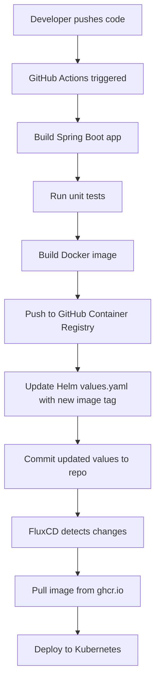
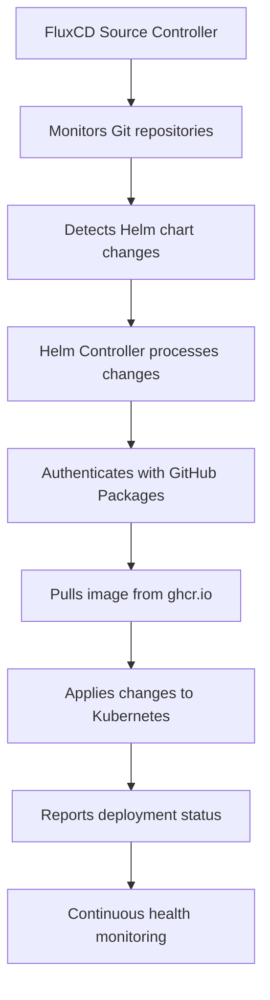

# GitOps Pipeline Architecture Design
## Multi-Tenant Kubernetes Deployment with FluxCD & GitHub Packages

---

## Table of Contents
1. [Executive Summary](#executive-summary)
2. [Architecture Overview](#architecture-overview)
3. [Repository Structure](#repository-structure)
4. [Workflow Design](#workflow-design)
5. [GitHub Packages Integration](#github-packages-integration)
6. [Implementation Plan](#implementation-plan)
7. [Configuration Examples](#configuration-examples)
8. [Multi-Tenant Scaling Strategy](#multi-tenant-scaling-strategy)
9. [Best Practices](#best-practices)
10. [Troubleshooting Guide](#troubleshooting-guide)
11. [Appendices](#appendices)

---

## Executive Summary

### Project Overview
This document outlines the design and implementation of a GitOps pipeline for deploying Spring Boot microservices to Kubernetes using GitHub Actions, GitHub Packages, and FluxCD. The architecture leverages GitHub's integrated ecosystem for complete artifact and container image management while supporting a multi-tenant pattern designed to scale from a 2-service POC to enterprise-grade deployments.

### Key Objectives
- **Team Autonomy**: Enable application teams to trigger deployments independently
- **GitHub Integration**: Leverage GitHub Packages for unified artifact management
- **Scalability**: Design for future multi-tenant expansion
- **Standardization**: Provide consistent deployment patterns while allowing customization
- **Automation**: Minimize manual intervention in deployment processes

### Technology Stack
- **Container Orchestration**: Kubernetes (kubeadm cluster)
- **GitOps Tool**: FluxCD
- **CI/CD Platform**: GitHub Actions
- **Container Registry**: GitHub Container Registry (ghcr.io)
- **Package Management**: Helm via GitHub Packages
- **Application Framework**: Spring Boot

---

## Architecture Overview

### High-Level Design with GitHub Packages

```
┌─────────────────────────────────────────────────────────────────────────────┐
│                           GitHub Organization                                │
│                                                                             │
│  ┌─────────────────┐    ┌─────────────────┐    ┌─────────────────┐        │
│  │   Team-A Repo   │    │   Team-B Repo   │    │  DevOps Repo    │        │
│  │                 │    │                 │    │                 │        │
│  │ ┌─────────────┐ │    │ ┌─────────────┐ │    │ ┌─────────────┐ │        │
│  │ │GitHub Actions│ │    │ │GitHub Actions│ │    │ │  FluxCD     │ │        │
│  │ │   Pipeline   │ │    │ │   Pipeline   │ │    │ │ Config      │ │        │
│  │ └─────────────┘ │    │ └─────────────┘ │    │ └─────────────┘ │        │
│  └─────────┬───────┘    └─────────┬───────┘    └─────────┬───────┘        │
│            │                       │                       │                │
│            ▼                       ▼                       │                │
│  ┌─────────────────────────────────────────────────────────┴─────────────┐  │
│  │                    GitHub Packages                                     │  │
│  │  ┌─────────────────┐              ┌─────────────────┐                 │  │  
│  │  │ Container Images│              │  Helm Charts    │                 │  │
│  │  │   (ghcr.io)     │              │  (Maven/NPM)    │                 │  │
│  │  └─────────────────┘              └─────────────────┘                 │  │
│  └─────────────────────────────────────────────────────────────────────────┘  │
└─────────────────────────────────────────────────────────────────────────────┘
                                       │
                                       ▼
                          ┌─────────────────────────────────────┐
                          │         Kubernetes Cluster          │
                          │                                     │
                          │  ┌─────────────┐ ┌─────────────┐   │
                          │  │   Service   │ │   Service   │   │
                          │  │   Team-A    │ │   Team-B    │   │
                          │  └─────────────┘ └─────────────┘   │
                          │                                     │
                          │        FluxCD Controllers          │
                          └─────────────────────────────────────┘
```

### Core Components

1. **Application Repositories**: Each team manages their own repository containing source code and customized Helm charts
2. **DevOps Repository**: Centralized repository containing FluxCD configurations and base Helm templates
3. **GitHub Actions**: CI/CD pipelines building, testing, and publishing to GitHub Packages
4. **GitHub Container Registry**: Container image storage at `ghcr.io`
5. **GitHub Packages**: Helm chart and artifact storage
6. **FluxCD**: GitOps operator managing automatic deployments and reconciliation
7. **Kubernetes Cluster**: Target deployment environment with namespace-based isolation

---

## GitHub Packages Integration

### GitHub Container Registry (ghcr.io)
- **Storage**: Docker images stored in GitHub Container Registry
- **Authentication**: GitHub tokens (GITHUB_TOKEN) with packages:read/write permissions
- **Access Control**: Repository-based access control
- **Visibility**: Public or private packages per repository settings

### Helm Chart Storage
- **Storage**: Helm charts can be stored as GitHub Packages
- **Alternative**: Direct Git-based Helm charts (recommended for simpler setup)
- **Versioning**: Semantic versioning aligned with Git tags

### Maven/NPM Artifacts (Future)
- **Java Artifacts**: Maven packages for shared libraries
- **NPM Packages**: Frontend or Node.js shared components
- **Binary Artifacts**: Release binaries and executables

### GitHub Packages Benefits
1. **Unified Access**: Single authentication mechanism
2. **Cost Effective**: Included in GitHub pricing
3. **Security**: Repository-based access control
4. **Integration**: Native GitHub Actions integration
5. **Audit Trail**: Complete package lifecycle tracking

---

## Repository Structure

### Application Team Repository Structure

```
team-{name}-service/
├── src/                           # Spring Boot application source code
│   ├── main/
│   │   ├── java/
│   │   └── resources/
│   └── test/
├── Dockerfile                     # Container image definition
├── pom.xml                       # Maven configuration (or build.gradle)
├── helm/                         # Team-specific Helm chart
│   ├── Chart.yaml               # Helm chart metadata
│   ├── values.yaml              # Team-specific configuration values
│   ├── values-dev.yaml          # Environment-specific values (future)
│   ├── values-staging.yaml      # Environment-specific values (future)
│   ├── values-prod.yaml         # Environment-specific values (future)
│   └── templates/               # Kubernetes resource templates (customized from base)
│       ├── deployment.yaml
│       ├── service.yaml
│       ├── configmap.yaml
│       ├── secret.yaml
│       ├── ingress.yaml         # Optional
│       └── hpa.yaml             # Optional: Horizontal Pod Autoscaler
├── .github/
│   └── workflows/
│       ├── build-deploy.yml     # Main CI/CD pipeline (updated for GitHub Packages)
│       ├── security-scan.yml    # Optional: Security scanning
│       └── integration-test.yml # Optional: Integration tests
├── k8s/                         # Optional: Additional Kubernetes manifests
├── docs/                        # Team-specific documentation
│   ├── README.md
│   ├── API.md
│   └── DEPLOYMENT.md
└── scripts/                     # Utility scripts
    ├── local-dev.sh
    └── health-check.sh
```

### DevOps Central Repository Structure

```
devops-gitops/
├── infrastructure/
│   ├── fluxcd/
│   │   ├── flux-system/                    # FluxCD installation manifests
│   │   │   ├── gotk-components.yaml
│   │   │   ├── gotk-sync.yaml
│   │   │   └── kustomization.yaml
│   │   ├── sources/                        # Git and Helm repository sources
│   │   │   ├── team-a-source.yaml
│   │   │   ├── team-b-source.yaml
│   │   │   └── github-packages-helm.yaml   # GitHub Packages Helm repo (optional)
│   │   ├── releases/                       # HelmRelease definitions
│   │   │   ├── team-a-release.yaml
│   │   │   ├── team-b-release.yaml
│   │   │   └── kustomization.yaml
│   │   ├── namespaces/                     # Namespace definitions
│   │   │   ├── gitops-poc.yaml
│   │   │   └── monitoring.yaml             # Optional
│   │   ├── rbac/                           # Role-Based Access Control
│   │   │   ├── service-accounts.yaml
│   │   │   ├── roles.yaml
│   │   │   └── role-bindings.yaml
│   │   ├── secrets/                        # GitHub Packages authentication
│   │   │   ├── github-packages-secret.yaml
│   │   │   └── image-pull-secrets.yaml
│   │   └── monitoring/                     # Optional: Monitoring setup
│   │       ├── prometheus/
│   │       ├── grafana/
│   │       └── alertmanager/
│   └── helm-templates/
│       ├── spring-boot-base/               # Base Helm chart template
│       │   ├── Chart.yaml
│       │   ├── values.yaml                 # Default values with GitHub Packages config
│       │   ├── values.schema.json          # JSON schema for validation
│       │   └── templates/
│       │       ├── deployment.yaml         # Updated with ghcr.io references
│       │       ├── service.yaml
│       │       ├── configmap.yaml
│       │       ├── secret.yaml
│       │       ├── ingress.yaml
│       │       ├── hpa.yaml
│       │       ├── servicemonitor.yaml     # For Prometheus monitoring
│       │       ├── _helpers.tpl            # Template helpers
│       │       └── NOTES.txt               # Post-installation notes
│       └── common/                         # Shared templates and utilities
│           ├── _labels.tpl
│           ├── _annotations.tpl
│           └── _security.tpl
├── scripts/
│   ├── setup/
│   │   ├── install-flux.sh                # FluxCD installation script
│   │   ├── bootstrap-cluster.sh           # Initial cluster setup
│   │   ├── create-secrets.sh              # Create GitHub Packages secrets
│   │   └── setup-github-packages.sh       # GitHub Packages configuration
│   ├── team-onboarding/
│   │   ├── create-team-repo.sh            # Script to scaffold new team repo
│   │   ├── setup-team-access.sh           # RBAC setup for new teams
│   │   ├── configure-github-packages.sh   # GitHub Packages setup per team
│   │   └── validate-team-config.sh        # Configuration validation
│   └── utilities/
│       ├── backup-flux-config.sh
│       ├── sync-status.sh                 # Check FluxCD sync status
│       ├── github-packages-cleanup.sh     # Clean old packages
│       └── troubleshoot.sh                # Common troubleshooting commands
├── docs/
│   ├── README.md                          # Main documentation
│   ├── ONBOARDING.md                      # Team onboarding guide
│   ├── GITHUB-PACKAGES.md                 # GitHub Packages usage guide
│   ├── ARCHITECTURE.md                    # Detailed architecture docs
│   ├── TROUBLESHOOTING.md                 # Common issues and solutions
│   ├── SCALING.md                         # Multi-tenant scaling guide
│   └── API-REFERENCE.md                   # Configuration API reference
├── examples/
│   ├── team-configurations/               # Example team configurations
│   ├── github-workflows/                  # Sample GitHub Actions workflows
│   ├── github-packages/                   # GitHub Packages examples
│   └── helm-values/                       # Example values files
└── tests/                                 # Configuration validation tests
    ├── flux-validation/
    ├── helm-lint/
    ├── github-packages/                   # GitHub Packages integration tests
    └── security-policies/
```

---

## Workflow Design

### Phase 1: Development & Build with GitHub Packages



#### Detailed Steps with GitHub Packages:

1. **Code Push Trigger**
   - Developer commits code to `main` branch
   - GitHub webhook triggers workflow

2. **Build Process**
   - Checkout source code
   - Set up Java environment
   - Run Maven/Gradle build
   - Execute unit tests
   - Generate test reports

3. **Container Image with GitHub Container Registry**
   - Build Docker image with semantic versioning
   - Tag with `ghcr.io/org/repo-name:tag` format
   - Authenticate using `GITHUB_TOKEN`
   - Push to GitHub Container Registry
   - Image automatically linked to repository

4. **Helm Values Update**
   - Update `values.yaml` with new image tag from ghcr.io
   - Commit changes back to repository
   - Use `GITHUB_TOKEN` for authentication

### Phase 2: GitOps Deployment with GitHub Authentication



---

## Configuration Examples

### GitHub Actions Workflow with GitHub Packages

```yaml
# .github/workflows/build-deploy.yml
name: Build and Deploy to GitHub Packages
on:
  push:
    branches: [main]
  pull_request:
    branches: [main]

env:
  REGISTRY: ghcr.io
  IMAGE_NAME: ${{ github.repository }}

jobs:
  build-and-deploy:
    runs-on: ubuntu-latest
    permissions:
      contents: write
      packages: write
      id-token: write

    steps:
    - name: Checkout repository
      uses: actions/checkout@v4
      with:
        token: ${{ secrets.GITHUB_TOKEN }}

    - name: Set up JDK 17
      uses: actions/setup-java@v3
      with:
        java-version: '17'
        distribution: 'temurin'

    - name: Cache Maven dependencies
      uses: actions/cache@v3
      with:
        path: ~/.m2
        key: ${{ runner.os }}-m2-${{ hashFiles('**/pom.xml') }}

    - name: Run tests
      run: mvn clean test

    - name: Build application
      run: mvn clean package -DskipTests

    - name: Set up Docker Buildx
      uses: docker/setup-buildx-action@v3

    - name: Log in to GitHub Container Registry
      uses: docker/login-action@v3
      with:
        registry: ${{ env.REGISTRY }}
        username: ${{ github.actor }}
        password: ${{ secrets.GITHUB_TOKEN }}

    - name: Extract metadata
      id: meta
      uses: docker/metadata-action@v5
      with:
        images: ${{ env.REGISTRY }}/${{ env.IMAGE_NAME }}
        tags: |
          type=ref,event=branch
          type=ref,event=pr
          type=sha,prefix={{branch}}-
          type=raw,value=latest,enable={{is_default_branch}}

    - name: Build and push Docker image
      uses: docker/build-push-action@v5
      with:
        context: .
        push: true
        tags: ${{ steps.meta.outputs.tags }}
        labels: ${{ steps.meta.outputs.labels }}
        cache-from: type=gha
        cache-to: type=gha,mode=max

    - name: Update Helm values with new image
      run: |
        # Extract the sha-based tag for predictable updates
        NEW_TAG="${{ github.ref_name }}-${{ github.sha }}"
        NEW_TAG=${NEW_TAG:0:50}  # Limit tag length
        
        # Update values.yaml with new image tag
        sed -i "s|tag:.*|tag: ${NEW_TAG}|" helm/values.yaml
        sed -i "s|repository:.*|repository: ${{ env.REGISTRY }}/${{ env.IMAGE_NAME }}|" helm/values.yaml

    - name: Commit updated values
      run: |
        git config --local user.email "action@github.com"
        git config --local user.name "GitHub Action"
        git add helm/values.yaml
        if git diff --staged --quiet; then
          echo "No changes to commit"
        else
          git commit -m "Update image tag to ${{ github.ref_name }}-${{ github.sha }}"
          git push
        fi
```

### Base Helm Chart Template with GitHub Container Registry

```yaml
# helm-templates/spring-boot-base/values.yaml
# Default configuration values for Spring Boot microservices with GitHub Packages

# Application configuration
app:
  name: "spring-boot-app"
  version: "1.0.0"
  
# Container image configuration (GitHub Container Registry)
image:
  registry: ghcr.io
  repository: "myorg/myapp"  # Will be updated to full ghcr.io path
  tag: "latest"
  pullPolicy: IfNotPresent

# Image pull secrets for GitHub Packages
imagePullSecrets:
  - name: github-packages-secret

# Service configuration
service:
  type: ClusterIP
  port: 8080
  targetPort: 8080
  annotations: {}

# Ingress configuration
ingress:
  enabled: false
  className: "nginx"
  annotations: {}
  hosts:
    - host: myapp.local
      paths:
        - path: /
          pathType: Prefix
  tls: []

# Resource management
resources:
  limits:
    cpu: 500m
    memory: 512Mi
  requests:
    cpu: 250m
    memory: 256Mi

# Horizontal Pod Autoscaler
autoscaling:
  enabled: false
  minReplicas: 1
  maxReplicas: 10
  targetCPUUtilizationPercentage: 80
  targetMemoryUtilizationPercentage: 80

# Health checks
health:
  livenessProbe:
    httpGet:
      path: /actuator/health/liveness
      port: 8080
    initialDelaySeconds: 60
    periodSeconds: 10
    timeoutSeconds: 5
    failureThreshold: 3
  
  readinessProbe:
    httpGet:
      path: /actuator/health/readiness
      port: 8080
    initialDelaySeconds: 30
    periodSeconds: 10
    timeoutSeconds: 5
    failureThreshold: 3

# Environment variables
env:
  - name: SPRING_PROFILES_ACTIVE
    value: "kubernetes"
  - name: MANAGEMENT_ENDPOINTS_WEB_EXPOSURE_INCLUDE
    value: "health,info,metrics,prometheus"

# ConfigMap data
configMap:
  data: {}

# Secret data (will be base64 encoded)
secret:
  data: {}

# Pod security context
podSecurityContext:
  runAsNonRoot: true
  runAsUser: 1001
  fsGroup: 1001

# Container security context
securityContext:
  allowPrivilegeEscalation: false
  capabilities:
    drop:
    - ALL
  readOnlyRootFilesystem: false

# Node selector
nodeSelector: {}

# Tolerations
tolerations: []

# Affinity rules
affinity: {}

# Service monitor for Prometheus
serviceMonitor:
  enabled: false
  interval: 30s
  path: /actuator/prometheus

# GitHub Packages specific configuration
github:
  packages:
    enabled: true
    registry: ghcr.io
    imagePullSecret: github-packages-secret
```

### GitHub Packages Authentication Secret

```yaml
# infrastructure/fluxcd/secrets/github-packages-secret.yaml
apiVersion: v1
kind: Secret
metadata:
  name: github-packages-secret
  namespace: gitops-poc
type: kubernetes.io/dockerconfigjson
data:
  .dockerconfigjson: |
    ewogICJhdXRocyI6IHsKICAgICJnaGNyLmlvIjogewogICAgICAidXNlcm5hbWUiOiAiPEdJVEhVQl9VU0VSTkFNRT4iLAogICAgICAicGFzc3dvcmQiOiAiPEdJVEhVQl9UT0tFTj4iLAogICAgICAiYXV0aCI6ICI8QkFTRTY0X0VOQ09ERURfVVNFUk5BTUVfUEFTU1dPUkQ+IgogICAgfQogIH0KfQ==
```

### Script to Create GitHub Packages Secret

```bash
#!/bin/bash
# scripts/setup/create-github-packages-secret.sh

# GitHub authentication details
GITHUB_USERNAME="${GITHUB_USERNAME:-your-github-username}"
GITHUB_TOKEN="${GITHUB_TOKEN:-your-github-token}"
NAMESPACE="${NAMESPACE:-gitops-poc}"

# Create docker config json
DOCKER_CONFIG_JSON=$(echo -n '{"auths":{"ghcr.io":{"username":"'$GITHUB_USERNAME'","password":"'$GITHUB_TOKEN'","auth":"'$(echo -n $GITHUB_USERNAME:$GITHUB_TOKEN | base64 -w0)'"}}}')

# Create secret in Kubernetes
kubectl create secret generic github-packages-secret \
  --from-literal=.dockerconfigjson="$DOCKER_CONFIG_JSON" \
  --type=kubernetes.io/dockerconfigjson \
  --namespace=$NAMESPACE

echo "GitHub Packages secret created successfully"
```

### FluxCD HelmRelease with GitHub Container Registry

```yaml
# infrastructure/fluxcd/releases/team-a-release.yaml
apiVersion: helm.toolkit.fluxcd.io/v2beta1
kind: HelmRelease
metadata:
  name: team-a-service
  namespace: flux-system
spec:
  interval: 10m
  targetNamespace: gitops-poc
  chart:
    spec:
      chart: ./helm
      version: '*'
      sourceRef:
        kind: GitRepository
        name: team-a-service
        namespace: flux-system
  values:
    app:
      name: team-a-service
    image:
      registry: ghcr.io
      repository: myorg/team-a-service
      pullPolicy: IfNotPresent
    imagePullSecrets:
      - name: github-packages-secret
    service:
      port: 8080
    ingress:
      enabled: true
      hosts:
        - host: team-a.local
          paths:
            - path: /
              pathType: Prefix
  install:
    createNamespace: true
    remediation:
      retries: 3
  upgrade:
    remediation:
      retries: 3
  rollback:
    cleanupOnFail: true
```

---

## Implementation Plan

### Phase 1: GitHub Packages Setup (Week 1)

#### Day 1-2: GitHub Organization Configuration
```bash
# Enable GitHub Packages for organization
# Configure package visibility settings
# Set up GitHub App or Personal Access Tokens
# Configure team permissions for packages
```

#### Day 3-4: FluxCD Installation with GitHub Integration
```bash
# Install FluxCD CLI
curl -s https://fluxcd.io/install.sh | sudo bash

# Bootstrap FluxCD with GitHub integration
flux bootstrap github \
  --owner=<github-username> \
  --repository=devops-gitops \
  --branch=main \
  --path=./infrastructure/fluxcd/flux-system \
  --personal \
  --token-auth
```

#### Day 5: GitHub Container Registry Setup
1. Create GitHub Packages authentication secrets
2. Test container image push/pull
3. Configure repository permissions
4. Validate image scanning features

### Phase 2: Application Integration with GitHub Packages (Week 2)

#### Day 1-2: Repository Setup
1. Create application team repositories
2. Configure GitHub Actions with Packages permissions
3. Set up branch protection rules
4. Configure repository secrets

#### Day 3-4: CI/CD Pipeline Implementation
1. Implement GitHub Actions workflows with ghcr.io
2. Test container image build and push
3. Configure automated Helm values updates
4. Test end-to-end build pipeline

#### Day 5: FluxCD Configuration
1. Create GitRepository sources for each team
2. Configure HelmRelease definitions with GitHub Container Registry
3. Set up image pull secrets
4. Test GitOps deployment

### Phase 3: Testing & Optimization (Week 3)

#### Day 1-2: Integration Testing
1. Deploy both services via GitOps pipeline
2. Test deployment rollbacks and updates
3. Validate GitHub Packages integration
4. Test image pull from private repositories

#### Day 3-4: Security & Performance
1. Configure package retention policies
2. Set up vulnerability scanning
3. Implement resource limits and quotas
4. Configure monitoring for GitHub Packages usage

#### Day 5: Documentation & Training
1. Complete GitHub Packages documentation
2. Create troubleshooting guides
3. Conduct team training on GitHub Packages
4. Establish support procedures

---

## Best Practices for GitHub Packages

### Container Image Management

#### 1. Image Tagging Strategy
```bash
# Semantic versioning
ghcr.io/myorg/myapp:v1.2.3

# Branch-based tagging
ghcr.io/myorg/myapp:main-abc123f

# Feature branch tagging
ghcr.io/myorg/myapp:feature-new-api-abc123f

# Latest tag for default branch
ghcr.io/myorg/myapp:latest
```

#### 2. Multi-Architecture Images
```yaml
# Docker buildx for multi-arch support
- name: Build and push multi-arch image
  uses: docker/build-push-action@v5
  with:
    context: .
    platforms: linux/amd64,linux/arm64
    push: true
    tags: ${{ steps.meta.outputs.tags }}
```

#### 3. Image Security Scanning
```yaml
# Add security scanning step
- name: Run Trivy vulnerability scanner
  uses: aquasecurity/trivy-action@master
  with:
    image-ref: ${{ env.REGISTRY }}/${{ env.IMAGE_NAME }}:${{ steps.meta.outputs.tags }}
    format: 'sarif'
    output: 'trivy-results.sarif'

- name: Upload Trivy scan results to GitHub Security tab
  uses: github/codeql-action/upload-sarif@v2
  with:
    sarif_file: 'trivy-results.sarif'
```

### Package Lifecycle Management

#### 1. Retention Policies
```yaml
# .github/workflows/package-cleanup.yml
name: Package Cleanup
on:
  schedule:
    - cron: '0 0 * * 0'  # Weekly cleanup

jobs:
  cleanup:
    runs-on: ubuntu-latest
    steps:
    - name: Delete old package versions
      uses: actions/delete-package-versions@v4
      with:
        package-name: 'myapp'
        package-type: 'container'
        min-versions-to-keep: 10
        delete-only-untagged-versions: true
```

#### 2. Package Visibility
```bash
# Set package visibility (public/private)
# Configure in repository settings or via API
gh api --method PATCH /orgs/ORGNAME/packages/container/PACKAGE_NAME \
  --field visibility=private
```

---

## Troubleshooting Guide

### GitHub Packages Specific Issues

#### 1. Authentication Issues

**Problem**: Unable to push/pull images to/from GitHub Container Registry

**Diagnosis**:
```bash
# Test GitHub Packages authentication
echo $GITHUB_TOKEN | docker login ghcr.io -u USERNAME --password-stdin

# Check token permissions
curl -H "Authorization: token $GITHUB_TOKEN" \
  https://api.github.com/user

# Verify package permissions
curl -H "Authorization: token $GITHUB_TOKEN" \
  https://api.github.com/orgs/ORGNAME/packages
```

**Solutions**:
- Verify `GITHUB_TOKEN` has `packages:read` and `packages:write` permissions
- Check repository visibility settings
- Ensure token scope includes package permissions
- Verify organization package settings

#### 2. Image Pull Issues in Kubernetes

**Problem**: Pods fail to pull images from GitHub Container Registry

**Diagnosis**:
```bash
# Check image pull secret
kubectl get secret github-packages-secret -o yaml

# Check pod events
kubectl describe pod <pod-name>

# Test image pull manually
docker pull ghcr.io/org/repo:tag
```

**Solutions**:
- Verify image pull secret is correctly configured
- Check image exists and is accessible
- Validate service account has access to pull secret
- Ensure image registry URL is correct

#### 3. Package Not Found

**Problem**: GitHub Actions reports package not found

**Diagnosis**:
```bash
# List packages in organization
gh api orgs/ORGNAME/packages

# Check package visibility
gh api orgs/ORGNAME/packages/container/PACKAGE_NAME

# Verify repository permissions
gh api repos/OWNER/REPO/collaborators
```

**Solutions**:
- Check package name and organization
- Verify package visibility settings
- Ensure GitHub Actions has appropriate permissions
- Check if package was deleted or moved

### FluxCD with GitHub Packages Issues

#### 1. HelmRelease ImagePullBackOff

**Problem**: Kubernetes cannot pull images from GitHub Container Registry

**Diagnosis**:
```bash
# Check HelmRelease status
kubectl describe helmrelease team-a-service -n flux-system

# Check deployment status
kubectl describe deployment team-a-service -n gitops-poc

# Verify image pull secret
kubectl get secret github-packages-secret -n gitops-poc -o yaml
```

**Solutions**:
- Recreate image pull secret with correct credentials
- Verify GitHub token permissions
- Check image repository URL format
- Ensure namespace has access to pull secret

---

## Appendices

### Appendix A: GitHub Packages Command Reference

#### GitHub CLI Commands
```bash
# List packages in organization
gh api orgs/ORGNAME/packages

# List packages for a repository
gh api repos/OWNER/REPO/packages

# Get package details
gh api orgs/ORGNAME/packages/container/PACKAGE_NAME

# Delete package version
gh api --method DELETE orgs/ORGNAME/packages/container/PACKAGE_NAME/versions/VERSION_ID

# Set package visibility
gh api --method PATCH orgs/ORGNAME/packages/container/PACKAGE_NAME \
  --field visibility=private
```

#### Docker Commands for GitHub Container Registry
```bash
# Login to GitHub Container Registry
echo $GITHUB_TOKEN | docker login ghcr.io -u USERNAME --password-stdin

# Build and tag image
docker build -t ghcr.io/orgname/repo-name:tag .

# Push image
docker push ghcr.io/orgname/repo-name:tag

# Pull image
docker pull ghcr.io/orgname/repo-name:tag

# List local images
docker images ghcr.io/orgname/*
```

### Appendix B: GitHub Packages Configuration Templates

#### Repository Settings for GitHub Packages
```json
{
  "name": "team-a-service",
  "visibility": "private",
  "packages": {
    "container_registry": {
      "enabled": true,
      "visibility": "private"
    },
    "package_registry": {
      "enabled": true,
      "visibility": "private"
    }
  },
  "actions": {
    "permissions": {
      "packages": "write",
      "contents": "write"
    }
  }
}
```

#### GitHub Actions Permissions Matrix
| Permission | Scope | Required For |
|------------|-------|--------------|
| `contents: write` | Repository | Pushing code changes |
| `packages: write` | Organization | Publishing packages |
| `packages: read` | Organization | Pulling packages |
| `id-token: write` | Workflow | OIDC authentication |

#### Environment Variables Template
```bash
# GitHub Packages Environment Variables
export GITHUB_TOKEN="ghp_xxxxxxxxxxxxxxxxxxxx"
export GITHUB_USERNAME="your-username"
export GITHUB_ORGANIZATION="your-org"
export CONTAINER_REGISTRY="ghcr.io"
export PACKAGE_REGISTRY="npm.pkg.github.com"
```

### Appendix C: Multi-Tenant Scaling with GitHub Packages

#### Organization-Level Package Management
```yaml
# Organization package policy
apiVersion: v1
kind: ConfigMap
metadata:
  name: github-packages-policy
  namespace: flux-system
data:
  retention-days: "30"
  max-versions: "10"
  vulnerability-scanning: "enabled"
  access-policy: "team-restricted"
```

#### Team-Based Package Access Control
```yaml
# Team package access
teams:
  team-a:
    packages:
      - "ghcr.io/myorg/team-a-*"
    permissions:
      - read
      - write
  team-b:
    packages:
      - "ghcr.io/myorg/team-b-*"
    permissions:
      - read
      - write
  devops:
    packages:
      - "ghcr.io/myorg/*"
    permissions:
      - read
      - write
      - admin
```

### Appendix D: Cost Optimization for GitHub Packages

#### Package Storage Costs
- **Free Tier**: 500MB storage, 1GB data transfer per month
- **Paid Plans**: Additional storage and transfer as needed
- **Cost Optimization**:
  - Implement retention policies
  - Use multi-stage Docker builds
  - Compress images when possible
  - Regular cleanup of unused packages

#### Storage Optimization Strategies
```dockerfile
# Multi-stage build example
FROM maven:3.8.4-openjdk-17 AS build
WORKDIR /app
COPY pom.xml .
RUN mvn dependency:go-offline
COPY src ./src
RUN mvn clean package -DskipTests

FROM openjdk:17-jre-slim
WORKDIR /app
COPY --from=build /app/target/app.jar app.jar
EXPOSE 8080
ENTRYPOINT ["java", "-jar", "app.jar"]
```

### Appendix E: Security Best Practices for GitHub Packages

#### Token Security
```markdown
# GitHub Token Security Checklist
- [ ] Use fine-grained personal access tokens when possible
- [ ] Limit token scope to minimum required permissions
- [ ] Set token expiration dates
- [ ] Rotate tokens regularly
- [ ] Store tokens as repository secrets, not in code
- [ ] Audit token usage regularly
- [ ] Use OIDC for enhanced security where supported
```

#### Container Image Security
```yaml
# Security scanning workflow
name: Security Scan
on:
  push:
    branches: [main]

jobs:
  security-scan:
    runs-on: ubuntu-latest
    steps:
    - uses: actions/checkout@v4
    
    - name: Build image
      run: docker build -t scan-image .
      
    - name: Run Trivy scanner
      uses: aquasecurity/trivy-action@master
      with:
        image-ref: 'scan-image'
        format: 'table'
        exit-code: '1'
        severity: 'CRITICAL,HIGH'
        
    - name: Run Snyk scan
      uses: snyk/actions/docker@master
      env:
        SNYK_TOKEN: ${{ secrets.SNYK_TOKEN }}
      with:
        image: scan-image
        args: --severity-threshold=high
```

### Appendix F: Monitoring and Observability

#### GitHub Packages Metrics
```yaml
# Prometheus metrics for GitHub Packages usage
apiVersion: v1
kind: ConfigMap
metadata:
  name: github-packages-metrics
data:
  queries.yml: |
    - name: package_downloads
      query: github_package_downloads_total
      description: Total package downloads
      
    - name: package_storage
      query: github_package_storage_bytes
      description: Package storage usage
      
    - name: package_versions
      query: github_package_versions_total
      description: Total package versions
```

#### Grafana Dashboard for GitHub Packages
```json
{
  "dashboard": {
    "title": "GitHub Packages Dashboard",
    "panels": [
      {
        "title": "Package Downloads",
        "type": "stat",
        "targets": [
          {
            "expr": "sum(github_package_downloads_total)",
            "legendFormat": "Total Downloads"
          }
        ]
      },
      {
        "title": "Storage Usage",
        "type": "gauge",
        "targets": [
          {
            "expr": "sum(github_package_storage_bytes) / (1024^3)",
            "legendFormat": "Storage (GB)"
          }
        ]
      }
    ]
  }
}
```

---

## Conclusion

This updated GitOps pipeline architecture leverages GitHub Packages to provide a unified, cost-effective solution for container image and artifact management. Key benefits include:

### GitHub Packages Integration Benefits
- **Unified Ecosystem**: Single platform for code, CI/CD, and package management
- **Cost Effectiveness**: Included in GitHub pricing with generous free tiers
- **Security**: Repository-based access control and vulnerability scanning
- **Simplicity**: Native integration with GitHub Actions and reduced complexity
- **Auditability**: Complete package lifecycle tracking within GitHub

### Scalability Advantages
- **Team Isolation**: Repository-based package access control
- **Multi-Environment Support**: Easy environment-specific package management
- **Cost Optimization**: Built-in retention policies and storage management
- **Security Integration**: Native vulnerability scanning and dependency tracking

### Implementation Success Factors
1. **Proper Authentication**: Use fine-grained tokens with minimal required permissions
2. **Retention Policies**: Implement automated cleanup to control storage costs
3. **Security Scanning**: Enable vulnerability scanning for all packages
4. **Access Control**: Use repository-based permissions for team isolation
5. **Monitoring**: Track package usage and performance metrics

This architecture provides a robust foundation for GitOps deployments while leveraging GitHub's integrated ecosystem for maximum efficiency and minimal operational overhead.

For additional support or questions about GitHub Packages integration, refer to the troubleshooting guide or contact the DevOps team.

---

*Document Version: 2.0 (GitHub Packages Integration)*  
*Last Updated: November 12, 2025*  
*Authors: DevOps Team*
