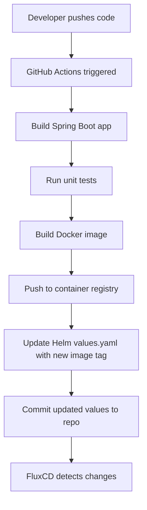
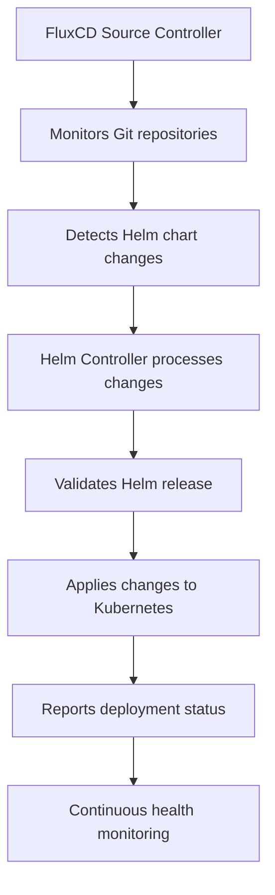
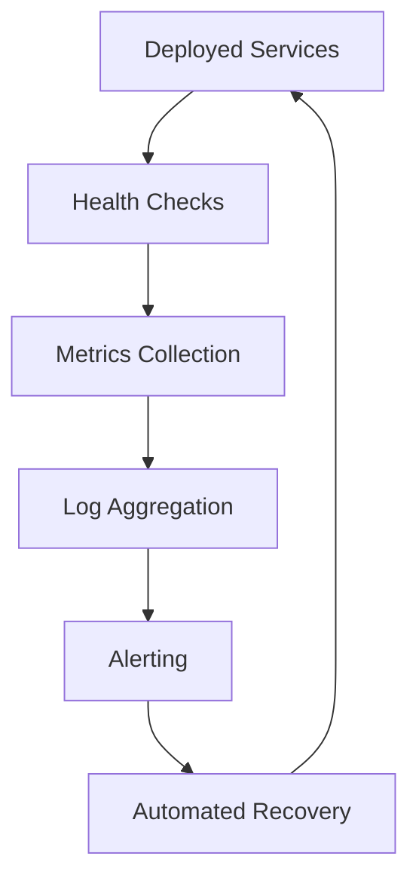

# GitOps Pipeline Architecture Design
## Multi-Tenant Kubernetes Deployment with FluxCD

---

## Table of Contents
1. [Executive Summary](#executive-summary)
2. [Architecture Overview](#architecture-overview)
3. [Repository Structure](#repository-structure)
4. [Workflow Design](#workflow-design)
5. [Implementation Plan](#implementation-plan)
6. [Configuration Examples](#configuration-examples)
7. [Multi-Tenant Scaling Strategy](#multi-tenant-scaling-strategy)
8. [Best Practices](#best-practices)
9. [Troubleshooting Guide](#troubleshooting-guide)
10. [Appendices](#appendices)

---

## Executive Summary

### Project Overview
This document outlines the design and implementation of a GitOps pipeline for deploying Spring Boot microservices to Kubernetes using GitHub Actions and FluxCD. The architecture supports a multi-tenant pattern designed to scale from a 2-service POC to enterprise-grade deployments.

### Key Objectives
- **Team Autonomy**: Enable application teams to trigger deployments independently
- **Scalability**: Design for future multi-tenant expansion
- **Standardization**: Provide consistent deployment patterns while allowing customization
- **Automation**: Minimize manual intervention in deployment processes

### Technology Stack
- **Container Orchestration**: Kubernetes (kubeadm cluster)
- **GitOps Tool**: FluxCD
- **CI/CD Platform**: GitHub Actions
- **Package Manager**: Helm
- **Application Framework**: Spring Boot

---

## Architecture Overview

### High-Level Design

```
┌─────────────────┐    ┌─────────────────┐    ┌─────────────────┐
│   Team-A Repo   │    │   Team-B Repo   │    │  DevOps Repo    │
│                 │    │                 │    │                 │
│ ┌─────────────┐ │    │ ┌─────────────┐ │    │ ┌─────────────┐ │
│ │GitHub Actions│ │    │ │GitHub Actions│ │    │ │  FluxCD     │ │
│ │   Pipeline   │ │    │ │   Pipeline   │ │    │ │ Config      │ │
│ └─────────────┘ │    │ └─────────────┘ │    │ └─────────────┘ │
└─────────┬───────┘    └─────────┬───────┘    └─────────┬───────┘
          │                       │                       │
          │                       │                       │
          └───────────────────────┼───────────────────────┤
                                  │                       │
                                  ▼                       ▼
                          ┌─────────────────────────────────────┐
                          │         Kubernetes Cluster          │
                          │                                     │
                          │  ┌─────────────┐ ┌─────────────┐   │
                          │  │   Service   │ │   Service   │   │
                          │  │   Team-A    │ │   Team-B    │   │
                          │  └─────────────┘ └─────────────┘   │
                          │                                     │
                          │        FluxCD Controllers          │
                          └─────────────────────────────────────┘
```

### Core Components

1. **Application Repositories**: Each team manages their own repository containing source code and customized Helm charts
2. **DevOps Repository**: Centralized repository containing FluxCD configurations and base Helm templates
3. **GitHub Actions**: CI/CD pipelines for building, testing, and updating deployment configurations
4. **FluxCD**: GitOps operator managing automatic deployments and reconciliation
5. **Kubernetes Cluster**: Target deployment environment with namespace-based isolation

---

## Repository Structure

### Application Team Repository Structure

```
team-{name}-service/
├── src/                           # Spring Boot application source code
│   ├── main/
│   │   ├── java/
│   │   └── resources/
│   └── test/
├── Dockerfile                     # Container image definition
├── pom.xml                       # Maven configuration (or build.gradle)
├── helm/                         # Team-specific Helm chart
│   ├── Chart.yaml               # Helm chart metadata
│   ├── values.yaml              # Team-specific configuration values
│   ├── values-dev.yaml          # Environment-specific values (future)
│   ├── values-staging.yaml      # Environment-specific values (future)
│   ├── values-prod.yaml         # Environment-specific values (future)
│   └── templates/               # Kubernetes resource templates (customized from base)
│       ├── deployment.yaml
│       ├── service.yaml
│       ├── configmap.yaml
│       ├── secret.yaml
│       ├── ingress.yaml         # Optional
│       └── hpa.yaml             # Optional: Horizontal Pod Autoscaler
├── .github/
│   └── workflows/
│       ├── build-deploy.yml     # Main CI/CD pipeline
│       ├── security-scan.yml    # Optional: Security scanning
│       └── integration-test.yml # Optional: Integration tests
├── k8s/                         # Optional: Additional Kubernetes manifests
├── docs/                        # Team-specific documentation
│   ├── README.md
│   ├── API.md
│   └── DEPLOYMENT.md
└── scripts/                     # Utility scripts
    ├── local-dev.sh
    └── health-check.sh
```

### DevOps Central Repository Structure

```
devops-gitops/
├── infrastructure/
│   ├── fluxcd/
│   │   ├── flux-system/                    # FluxCD installation manifests
│   │   │   ├── gotk-components.yaml
│   │   │   ├── gotk-sync.yaml
│   │   │   └── kustomization.yaml
│   │   ├── sources/                        # Git and Helm repository sources
│   │   │   ├── team-a-source.yaml
│   │   │   ├── team-b-source.yaml
│   │   │   └── helm-repositories.yaml
│   │   ├── releases/                       # HelmRelease definitions
│   │   │   ├── team-a-release.yaml
│   │   │   ├── team-b-release.yaml
│   │   │   └── kustomization.yaml
│   │   ├── namespaces/                     # Namespace definitions
│   │   │   ├── gitops-poc.yaml
│   │   │   └── monitoring.yaml             # Optional
│   │   ├── rbac/                           # Role-Based Access Control
│   │   │   ├── service-accounts.yaml
│   │   │   ├── roles.yaml
│   │   │   └── role-bindings.yaml
│   │   └── monitoring/                     # Optional: Monitoring setup
│   │       ├── prometheus/
│   │       ├── grafana/
│   │       └── alertmanager/
│   └── helm-templates/
│       ├── spring-boot-base/               # Base Helm chart template
│       │   ├── Chart.yaml
│       │   ├── values.yaml                 # Default values with documentation
│       │   ├── values.schema.json          # JSON schema for validation
│       │   └── templates/
│       │       ├── deployment.yaml
│       │       ├── service.yaml
│       │       ├── configmap.yaml
│       │       ├── secret.yaml
│       │       ├── ingress.yaml
│       │       ├── hpa.yaml
│       │       ├── servicemonitor.yaml     # For Prometheus monitoring
│       │       ├── _helpers.tpl            # Template helpers
│       │       └── NOTES.txt               # Post-installation notes
│       └── common/                         # Shared templates and utilities
│           ├── _labels.tpl
│           ├── _annotations.tpl
│           └── _security.tpl
├── scripts/
│   ├── setup/
│   │   ├── install-flux.sh                # FluxCD installation script
│   │   ├── bootstrap-cluster.sh           # Initial cluster setup
│   │   └── create-secrets.sh              # Create necessary secrets
│   ├── team-onboarding/
│   │   ├── create-team-repo.sh            # Script to scaffold new team repo
│   │   ├── setup-team-access.sh           # RBAC setup for new teams
│   │   └── validate-team-config.sh        # Configuration validation
│   └── utilities/
│       ├── backup-flux-config.sh
│       ├── sync-status.sh                 # Check FluxCD sync status
│       └── troubleshoot.sh                # Common troubleshooting commands
├── docs/
│   ├── README.md                          # Main documentation
│   ├── ONBOARDING.md                      # Team onboarding guide
│   ├── ARCHITECTURE.md                    # Detailed architecture docs
│   ├── TROUBLESHOOTING.md                 # Common issues and solutions
│   ├── SCALING.md                         # Multi-tenant scaling guide
│   └── API-REFERENCE.md                   # Configuration API reference
├── examples/
│   ├── team-configurations/               # Example team configurations
│   ├── github-workflows/                  # Sample GitHub Actions workflows
│   └── helm-values/                       # Example values files
└── tests/                                 # Configuration validation tests
    ├── flux-validation/
    ├── helm-lint/
    └── security-policies/
```

---

## Workflow Design

### Phase 1: Development & Build (Application Repository)



#### Detailed Steps:

1. **Code Push Trigger**
   - Developer commits code to `main` branch
   - GitHub webhook triggers workflow

2. **Build Process**
   - Checkout source code
   - Set up Java environment
   - Run Maven/Gradle build
   - Execute unit tests
   - Generate test reports

3. **Container Image**
   - Build Docker image with semantic versioning
   - Scan image for vulnerabilities (optional)
   - Push to container registry (Docker Hub, ECR, etc.)
   - Tag with commit SHA and semantic version

4. **Helm Values Update**
   - Update `values.yaml` with new image tag
   - Commit changes back to repository
   - Use service account token for authentication

### Phase 2: GitOps Deployment (FluxCD)



#### Detailed Steps:

1. **Change Detection**
   - FluxCD monitors application repositories every 5 minutes (configurable)
   - Detects changes in Helm charts and values files

2. **Validation & Processing**
   - Validates Helm chart syntax and dependencies
   - Processes template rendering with updated values
   - Checks resource quotas and policies

3. **Deployment Execution**
   - Applies Kubernetes manifests to target namespace
   - Manages rolling updates and rollbacks
   - Ensures deployment health and readiness

4. **Status Reporting**
   - Updates Git repository with deployment status
   - Provides logs and events for troubleshooting
   - Triggers alerts for failed deployments

### Phase 3: Monitoring & Maintenance



---

## Implementation Plan

### Phase 1: Infrastructure Setup (Week 1)

#### Day 1-2: FluxCD Installation
```bash
# Install FluxCD CLI
curl -s https://fluxcd.io/install.sh | sudo bash

# Bootstrap FluxCD on cluster
flux bootstrap github \
  --owner=<github-username> \
  --repository=devops-gitops \
  --branch=main \
  --path=./infrastructure/fluxcd/flux-system \
  --personal
```

#### Day 3-4: Base Infrastructure
1. Create DevOps repository structure
2. Develop base Helm chart templates
3. Configure namespace and RBAC policies
4. Set up container registry access

#### Day 5: Validation & Documentation
1. Test FluxCD installation and connectivity
2. Validate base Helm templates
3. Create initial documentation

### Phase 2: Application Integration (Week 2)

#### Day 1-2: Repository Setup
1. Create application team repositories
2. Customize base Helm templates for each service
3. Configure GitHub repository permissions

#### Day 3-4: CI/CD Pipeline Implementation
1. Implement GitHub Actions workflows
2. Configure container registry integration
3. Set up automated Helm values updates

#### Day 5: FluxCD Configuration
1. Create GitRepository sources for each team
2. Configure HelmRelease definitions
3. Test end-to-end pipeline

### Phase 3: Testing & Optimization (Week 3)

#### Day 1-2: Integration Testing
1. Deploy both services via GitOps pipeline
2. Test deployment rollbacks and updates
3. Validate health checks and monitoring

#### Day 3-4: Performance & Security
1. Implement security scanning in pipelines
2. Configure resource limits and quotas
3. Set up monitoring and alerting

#### Day 5: Documentation & Training
1. Complete documentation
2. Create troubleshooting guides
3. Conduct team training sessions

---

## Configuration Examples

### GitHub Actions Workflow

```yaml
# .github/workflows/build-deploy.yml
name: Build and Deploy
on:
  push:
    branches: [main]
  pull_request:
    branches: [main]

env:
  REGISTRY: docker.io
  IMAGE_NAME: team-a-service

jobs:
  build-and-deploy:
    runs-on: ubuntu-latest
    permissions:
      contents: write
      packages: write

    steps:
    - name: Checkout repository
      uses: actions/checkout@v4
      with:
        token: ${{ secrets.GITHUB_TOKEN }}

    - name: Set up JDK 17
      uses: actions/setup-java@v3
      with:
        java-version: '17'
        distribution: 'temurin'

    - name: Cache Maven dependencies
      uses: actions/cache@v3
      with:
        path: ~/.m2
        key: ${{ runner.os }}-m2-${{ hashFiles('**/pom.xml') }}

    - name: Run tests
      run: mvn clean test

    - name: Build application
      run: mvn clean package -DskipTests

    - name: Set up Docker Buildx
      uses: docker/setup-buildx-action@v3

    - name: Log in to Container Registry
      uses: docker/login-action@v3
      with:
        registry: ${{ env.REGISTRY }}
        username: ${{ secrets.DOCKER_USERNAME }}
        password: ${{ secrets.DOCKER_PASSWORD }}

    - name: Generate image tag
      id: image-tag
      run: |
        SHORT_SHA=$(echo ${{ github.sha }} | cut -c1-7)
        echo "tag=v1.0.${GITHUB_RUN_NUMBER}-${SHORT_SHA}" >> $GITHUB_OUTPUT

    - name: Build and push Docker image
      uses: docker/build-push-action@v5
      with:
        context: .
        push: true
        tags: |
          ${{ env.REGISTRY }}/${{ env.IMAGE_NAME }}:${{ steps.image-tag.outputs.tag }}
          ${{ env.REGISTRY }}/${{ env.IMAGE_NAME }}:latest

    - name: Update Helm values
      run: |
        sed -i "s|tag:.*|tag: ${{ steps.image-tag.outputs.tag }}|" helm/values.yaml

    - name: Commit updated values
      run: |
        git config --local user.email "action@github.com"
        git config --local user.name "GitHub Action"
        git add helm/values.yaml
        git commit -m "Update image tag to ${{ steps.image-tag.outputs.tag }}" || exit 0
        git push
```

### Base Helm Chart Template

```yaml
# helm-templates/spring-boot-base/values.yaml
# Default configuration values for Spring Boot microservices

# Application configuration
app:
  name: "spring-boot-app"
  version: "1.0.0"
  
# Container image configuration
image:
  repository: "docker.io/myorg/myapp"
  tag: "latest"
  pullPolicy: IfNotPresent

# Service configuration
service:
  type: ClusterIP
  port: 8080
  targetPort: 8080
  annotations: {}

# Ingress configuration
ingress:
  enabled: false
  className: "nginx"
  annotations: {}
  hosts:
    - host: myapp.local
      paths:
        - path: /
          pathType: Prefix
  tls: []

# Resource management
resources:
  limits:
    cpu: 500m
    memory: 512Mi
  requests:
    cpu: 250m
    memory: 256Mi

# Horizontal Pod Autoscaler
autoscaling:
  enabled: false
  minReplicas: 1
  maxReplicas: 10
  targetCPUUtilizationPercentage: 80
  targetMemoryUtilizationPercentage: 80

# Health checks
health:
  livenessProbe:
    httpGet:
      path: /actuator/health/liveness
      port: 8080
    initialDelaySeconds: 60
    periodSeconds: 10
    timeoutSeconds: 5
    failureThreshold: 3
  
  readinessProbe:
    httpGet:
      path: /actuator/health/readiness
      port: 8080
    initialDelaySeconds: 30
    periodSeconds: 10
    timeoutSeconds: 5
    failureThreshold: 3

# Environment variables
env:
  - name: SPRING_PROFILES_ACTIVE
    value: "kubernetes"
  - name: MANAGEMENT_ENDPOINTS_WEB_EXPOSURE_INCLUDE
    value: "health,info,metrics,prometheus"

# ConfigMap data
configMap:
  data: {}

# Secret data (will be base64 encoded)
secret:
  data: {}

# Pod security context
podSecurityContext:
  runAsNonRoot: true
  runAsUser: 1001
  fsGroup: 1001

# Container security context
securityContext:
  allowPrivilegeEscalation: false
  capabilities:
    drop:
    - ALL
  readOnlyRootFilesystem: false

# Node selector
nodeSelector: {}

# Tolerations
tolerations: []

# Affinity rules
affinity: {}

# Service monitor for Prometheus
serviceMonitor:
  enabled: false
  interval: 30s
  path: /actuator/prometheus
```

### FluxCD GitRepository Source

```yaml
# infrastructure/fluxcd/sources/team-a-source.yaml
apiVersion: source.toolkit.fluxcd.io/v1beta2
kind: GitRepository
metadata:
  name: team-a-service
  namespace: flux-system
spec:
  interval: 5m
  ref:
    branch: main
  url: https://github.com/myorg/team-a-service
  secretRef:
    name: github-token
```

### FluxCD HelmRelease

```yaml
# infrastructure/fluxcd/releases/team-a-release.yaml
apiVersion: helm.toolkit.fluxcd.io/v2beta1
kind: HelmRelease
metadata:
  name: team-a-service
  namespace: flux-system
spec:
  interval: 10m
  targetNamespace: gitops-poc
  chart:
    spec:
      chart: ./helm
      version: '*'
      sourceRef:
        kind: GitRepository
        name: team-a-service
        namespace: flux-system
  values:
    app:
      name: team-a-service
    service:
      port: 8080
    ingress:
      enabled: true
      hosts:
        - host: team-a.local
          paths:
            - path: /
              pathType: Prefix
  install:
    createNamespace: true
    remediation:
      retries: 3
  upgrade:
    remediation:
      retries: 3
  rollback:
    cleanupOnFail: true
```

---

## Multi-Tenant Scaling Strategy

### Current POC Configuration

```yaml
# Single namespace deployment
apiVersion: v1
kind: Namespace
metadata:
  name: gitops-poc
  labels:
    name: gitops-poc
    managed-by: flux
```

### Scaling to Multi-Environment

#### Environment-Specific Namespaces
```yaml
# Development Environment
apiVersion: v1
kind: Namespace
metadata:
  name: development
  labels:
    environment: dev
    managed-by: flux
---
# Staging Environment
apiVersion: v1
kind: Namespace
metadata:
  name: staging
  labels:
    environment: staging
    managed-by: flux
---
# Production Environment
apiVersion: v1
kind: Namespace
metadata:
  name: production
  labels:
    environment: prod
    managed-by: flux
```

#### Team-Specific Namespaces
```yaml
# Team A Namespace
apiVersion: v1
kind: Namespace
metadata:
  name: team-a
  labels:
    team: team-a
    managed-by: flux
  annotations:
    scheduler.alpha.kubernetes.io/node-selector: "team=team-a"
---
# Resource Quota for Team A
apiVersion: v1
kind: ResourceQuota
metadata:
  name: team-a-quota
  namespace: team-a
spec:
  hard:
    requests.cpu: "4"
    requests.memory: 8Gi
    limits.cpu: "8"
    limits.memory: 16Gi
    persistentvolumeclaims: "10"
    services: "5"
    secrets: "10"
    configmaps: "10"
```

### RBAC Configuration for Multi-Tenancy

```yaml
# Service Account for Team A
apiVersion: v1
kind: ServiceAccount
metadata:
  name: team-a-sa
  namespace: team-a
---
# Role for Team A
apiVersion: rbac.authorization.k8s.io/v1
kind: Role
metadata:
  namespace: team-a
  name: team-a-role
rules:
- apiGroups: [""]
  resources: ["pods", "services", "configmaps", "secrets"]
  verbs: ["get", "list", "watch", "create", "update", "patch", "delete"]
- apiGroups: ["apps"]
  resources: ["deployments", "replicasets"]
  verbs: ["get", "list", "watch", "create", "update", "patch", "delete"]
- apiGroups: ["networking.k8s.io"]
  resources: ["ingresses"]
  verbs: ["get", "list", "watch", "create", "update", "patch", "delete"]
---
# Role Binding for Team A
apiVersion: rbac.authorization.k8s.io/v1
kind: RoleBinding
metadata:
  name: team-a-binding
  namespace: team-a
subjects:
- kind: ServiceAccount
  name: team-a-sa
  namespace: team-a
roleRef:
  kind: Role
  name: team-a-role
  apiGroup: rbac.authorization.k8s.io
```

### Network Policies for Isolation

```yaml
# Network Policy for Team A
apiVersion: networking.k8s.io/v1
kind: NetworkPolicy
metadata:
  name: team-a-network-policy
  namespace: team-a
spec:
  podSelector: {}
  policyTypes:
  - Ingress
  - Egress
  ingress:
  - from:
    - namespaceSelector:
        matchLabels:
          name: ingress-nginx
    - namespaceSelector:
        matchLabels:
          name: team-a
  egress:
  - to:
    - namespaceSelector:
        matchLabels:
          name: kube-system
    ports:
    - protocol: TCP
      port: 53
    - protocol: UDP
      port: 53
  - to: {}
    ports:
    - protocol: TCP
      port: 443
    - protocol: TCP
      port: 80
```

---

## Best Practices

### Security Best Practices

#### 1. Container Security
```dockerfile
# Secure Dockerfile example
FROM openjdk:17-jre-slim

# Create non-root user
RUN groupadd -r appuser && useradd -r -g appuser appuser

# Set working directory
WORKDIR /app

# Copy application
COPY target/app.jar app.jar

# Change ownership
RUN chown -R appuser:appuser /app

# Switch to non-root user
USER appuser

# Expose port
EXPOSE 8080

# Health check
HEALTHCHECK --interval=30s --timeout=10s --start-period=60s --retries=3 \
  CMD curl -f http://localhost:8080/actuator/health || exit 1

# Run application
ENTRYPOINT ["java", "-jar", "app.jar"]
```

#### 2. Kubernetes Security Context
```yaml
# Secure pod configuration
securityContext:
  runAsNonRoot: true
  runAsUser: 1001
  runAsGroup: 1001
  fsGroup: 1001
  seccompProfile:
    type: RuntimeDefault

containers:
- name: app
  securityContext:
    allowPrivilegeEscalation: false
    capabilities:
      drop:
      - ALL
    readOnlyRootFilesystem: true
  volumeMounts:
  - name: tmp
    mountPath: /tmp
  - name: cache
    mountPath: /app/cache

volumes:
- name: tmp
  emptyDir: {}
- name: cache
  emptyDir: {}
```

#### 3. Secret Management
```yaml
# External Secrets Operator configuration
apiVersion: external-secrets.io/v1beta1
kind: SecretStore
metadata:
  name: vault-backend
  namespace: team-a
spec:
  provider:
    vault:
      server: "https://vault.company.com"
      path: "secret"
      version: "v2"
      auth:
        kubernetes:
          mountPath: "kubernetes"
          role: "team-a-role"
          serviceAccountRef:
            name: "team-a-sa"
---
apiVersion: external-secrets.io/v1beta1
kind: ExternalSecret
metadata:
  name: app-secrets
  namespace: team-a
spec:
  refreshInterval: 1h
  secretStoreRef:
    name: vault-backend
    kind: SecretStore
  target:
    name: app-secrets
    creationPolicy: Owner
  data:
  - secretKey: database-password
    remoteRef:
      key: team-a/database
      property: password
```

### Monitoring and Observability

#### 1. Prometheus ServiceMonitor
```yaml
# ServiceMonitor for application metrics
apiVersion: monitoring.coreos.com/v1
kind: ServiceMonitor
metadata:
  name: team-a-service
  namespace: team-a
  labels:
    app: team-a-service
spec:
  selector:
    matchLabels:
      app: team-a-service
  endpoints:
  - port: http
    path: /actuator/prometheus
    interval: 30s
    scrapeTimeout: 10s
```

#### 2. Grafana Dashboard Configuration
```json
{
  "dashboard": {
    "title": "Team A Service Dashboard",
    "panels": [
      {
        "title": "Request Rate",
        "type": "graph",
        "targets": [
          {
            "expr": "rate(http_requests_total{job=\"team-a-service\"}[5m])",
            "legendFormat": "{{method}} {{status}}"
          }
        ]
      },
      {
        "title": "Response Time",
        "type": "graph",
        "targets": [
          {
            "expr": "histogram_quantile(0.95, rate(http_request_duration_seconds_bucket{job=\"team-a-service\"}[5m]))",
            "legendFormat": "95th percentile"
          }
        ]
      }
    ]
  }
}
```

#### 3. Application Logging
```yaml
# Fluent Bit configuration for log collection
apiVersion: v1
kind: ConfigMap
metadata:
  name: fluent-bit-config
  namespace: team-a
data:
  fluent-bit.conf: |
    [INPUT]
        Name tail
        Path /var/log/containers/*team-a-service*.log
        Parser docker
        Tag team-a.*
        Refresh_Interval 5
        
    [FILTER]
        Name kubernetes
        Match team-a.*
        Keep_Log Off
        Merge_Log On
        
    [OUTPUT]
        Name forward
        Match team-a.*
        Host fluentd.logging
        Port 24224
```

### Performance Optimization

#### 1. Resource Management
```yaml
# Vertical Pod Autoscaler
apiVersion: autoscaling.k8s.io/v1
kind: VerticalPodAutoscaler
metadata:
  name: team-a-service-vpa
  namespace: team-a
spec:
  targetRef:
    apiVersion: "apps/v1"
    kind: Deployment
    name: team-a-service
  updatePolicy:
    updateMode: "Auto"
  resourcePolicy:
    containerPolicies:
    - containerName: app
      maxAllowed:
        cpu: 1
        memory: 2Gi
      minAllowed:
        cpu: 100m
        memory: 128Mi
```

#### 2. Pod Disruption Budget
```yaml
apiVersion: policy/v1
kind: PodDisruptionBudget
metadata:
  name: team-a-service-pdb
  namespace: team-a
spec:
  minAvailable: 1
  selector:
    matchLabels:
      app: team-a-service
```

---

## Troubleshooting Guide

### Common Issues and Solutions

#### 1. FluxCD Sync Issues

**Problem**: FluxCD not detecting changes in Git repository

**Diagnosis**:
```bash
# Check FluxCD controllers status
kubectl get pods -n flux-system

# Check GitRepository source status
kubectl describe gitrepository team-a-service -n flux-system

# Check HelmRelease status
kubectl describe helmrelease team-a-service -n flux-system

# Force reconciliation
flux reconcile source git team-a-service
```

**Solutions**:
- Verify Git repository accessibility and authentication
- Check webhook configuration
- Validate FluxCD permissions
- Review network policies blocking Git access

#### 2. Helm Deployment Failures

**Problem**: Helm release fails to deploy

**Diagnosis**:
```bash
# Check Helm release status
helm status team-a-service -n gitops-poc

# View
